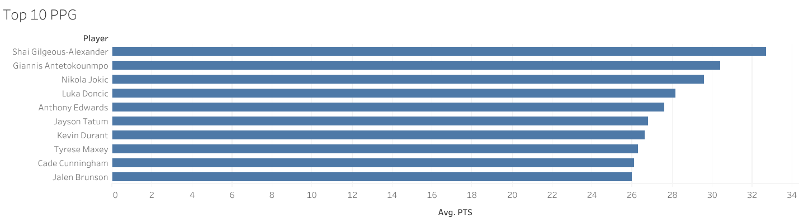
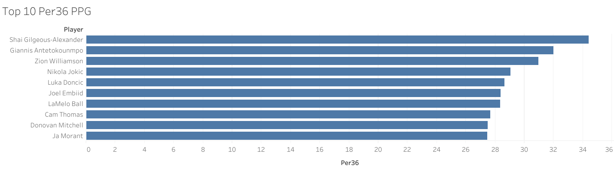
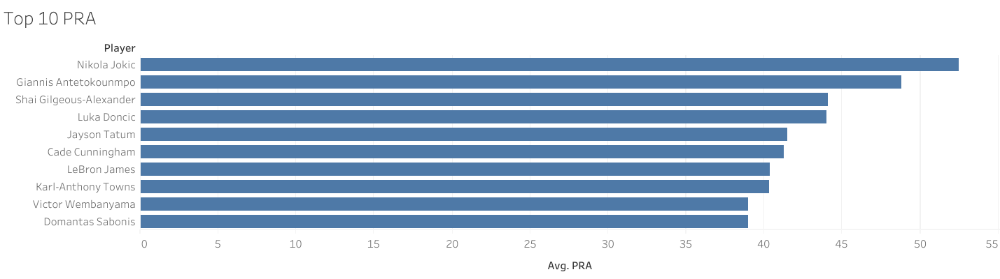
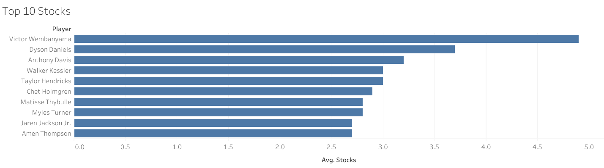
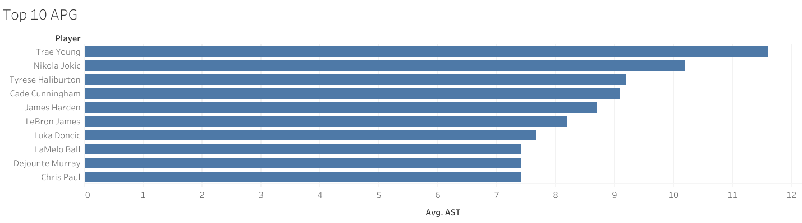
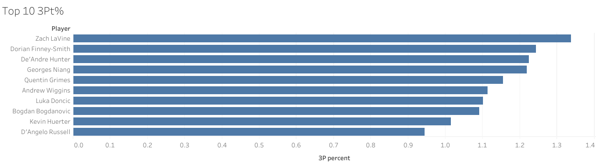
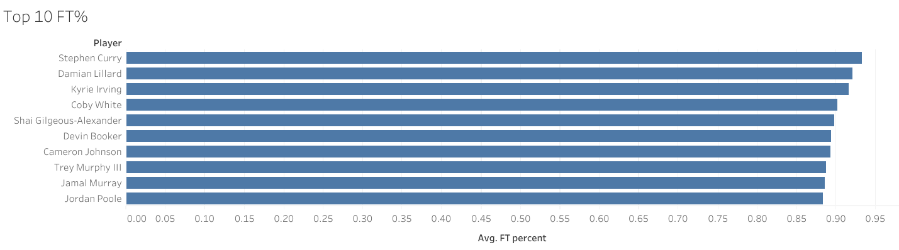
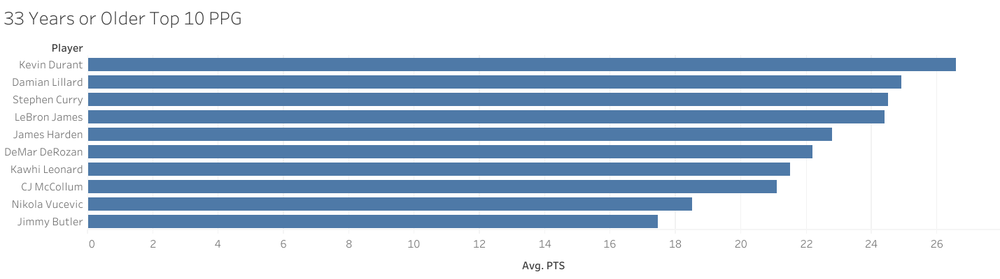
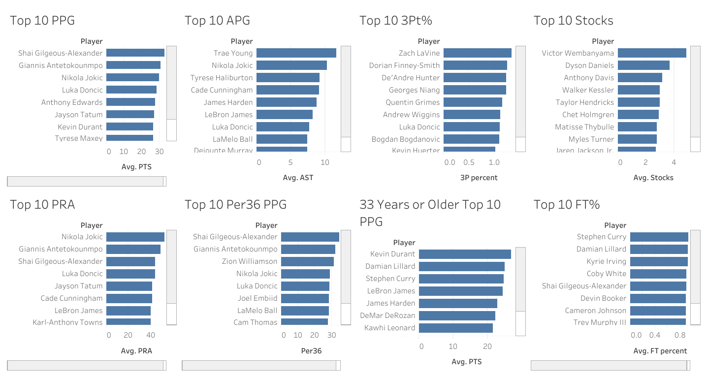

# NBA Player Stats SQL Project

My goal was to create a SQL-based data exploration project using NBA per-game player stats from the 2024-25 regular season. This project includes a table schema, cleaned dataset .csv file, and a set of example sample queries to analyze players' performance. 

-----

# Files Included
- nba_stats.csv - Cleaned dataset of NBA player per game stats for the 2024-25 regular season  
- schema.sql - SQL schema to define the 'nba_stats' table  
- queries.sql - Sample SQL queries for different insights (Top scorers, best shooters, PRA leaders, etc.)

-----

# How to Use 
1. Create a new database in MySQL Workbench  
2. Run 'schema.sql' to create the 'nba_stats' table  
3. Import 'nba_stats.csv' into 'nba_stats' table  
4. Run sample queries from 'queries.sql' or your own queries to explore the data

-----

# Sample Questions Answered

- Who are the top 10 scorers in the league by PPG, APG, and RPG?  
- Which players shoot the best from the 3?
- Which players shoot the best from the free throw line? 
- Which players lead in total PRA?  
- What players average the most PPG Per36  
- Who are the top scorers over the age of 33?  

-----

# Tools Used

- MySQL Workbench  
- Github  
- Kaggle.com  
- Tableau

-----

# Sample Visualization (Tableau Dashboards)
1. Top 10 Points Per Game

2. Top 10 Per 36 PPG

3. Top 10 PRA (Points + Rebounds + Assists)

4. Top 10 Stocks (Steals + Blocks)

5. Top 10 Assists Per Game

6. Top 10 3PT Shooters

7. Top 10 Free Throw Shooters

8. Top 10 PPG (Age 33+)

9. Full Dashboard

-----

# Links to Tableau Dashboards

- [Top 10 PPG](https://public.tableau.com/app/profile/tucker.estep/viz/TopTenPPG/Top10PPG)
- [Top 10 Per 36 PPG](https://public.tableau.com/app/profile/tucker.estep/viz/TopTenPer36PPG/Top10Per36PPG)
- [Top 10 PRA](https://public.tableau.com/app/profile/tucker.estep/viz/TopTenPRA/Top10PRA)
- [Top 10 Stocks](https://public.tableau.com/app/profile/tucker.estep/viz/TopTenStocks/Top10Stocks)
- [Top 10 APG](https://public.tableau.com/app/profile/tucker.estep/viz/TopTenAPG_17533002351570/Top10APG)
- [Top 10 3PT Shooters](https://public.tableau.com/app/profile/tucker.estep/viz/TopTen3Pt/Top103Pt)
- [Top 10 FT%](https://public.tableau.com/app/profile/tucker.estep/viz/Top10FT/Top10FT)
- [Top 10 PPG (Age 33+)](https://public.tableau.com/app/profile/tucker.estep/viz/33YearsorOlderTop10PPG/33YearsorOlderTop10PPG)
- [Full Tableau Dashboard (All Charts)](https://public.tableau.com/app/profile/tucker.estep/viz/nba_stats_te/nba_stats_dashboard)

-----

# Data Source

This project uses data from [NBA Player Stats 2024–25 (Per Game)](https://www.kaggle.com/datasets/ratin21/nba-player-stats-2024-25-per-game) dataset on Kaggle, created by [Ratin21](https://www.kaggle.com/ratin21).  
All rights belong to the original author.
